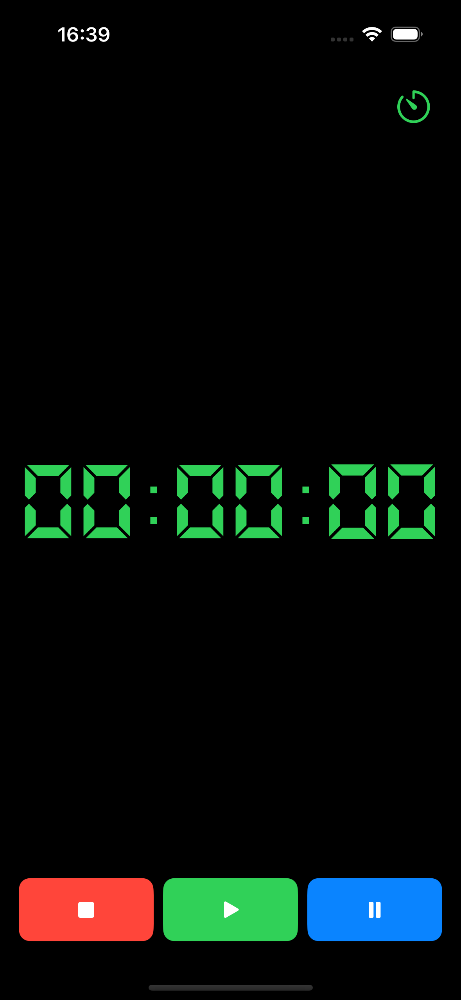
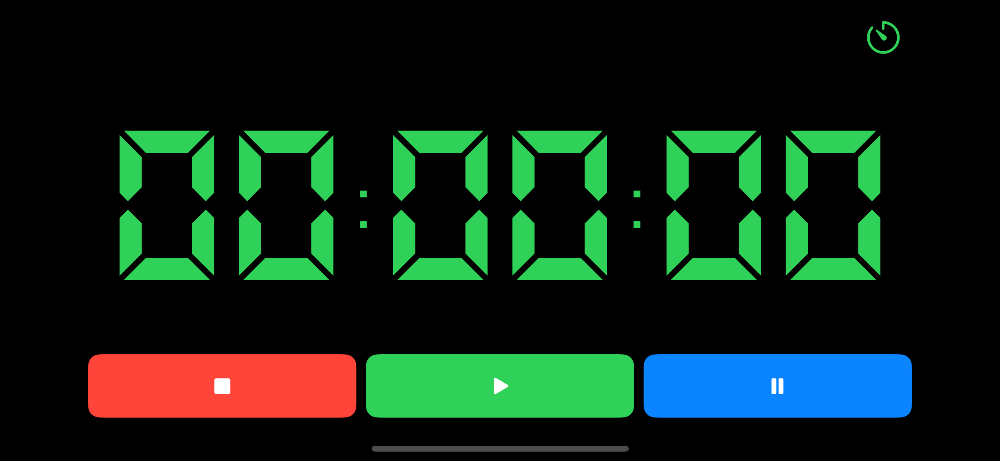

# Tempo

I was trying to find a digital countdown to use in my JiuJitsu classes, but every timer on AppStore was paid or had a lot of ads. So I spent a few hours building my own timer app without any ads.

### Screenshots

  
  

### Thanks

Especial thanks for the free resources from:

- [Pixabey](https://pixabay.com/sound-effects/search/alert/) for the mp3 file.
- [Dafont](https://www.dafont.com/pt/ds-digital.font) for the digital font style.
